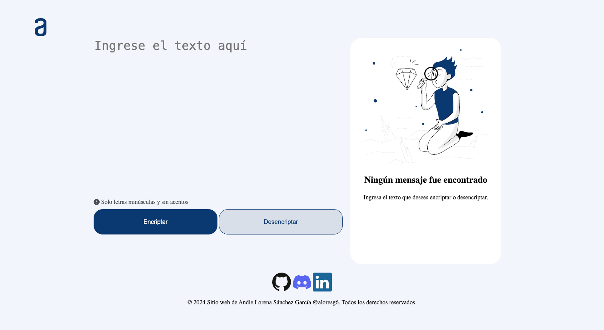
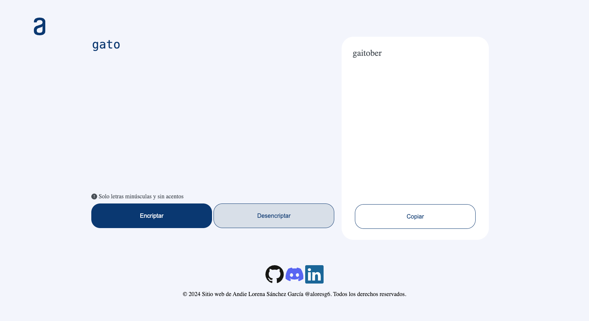
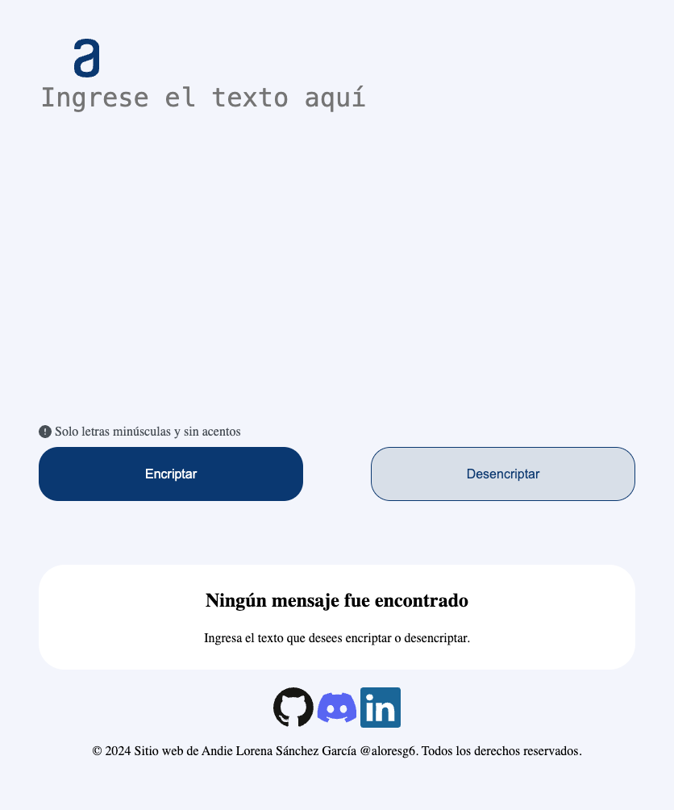
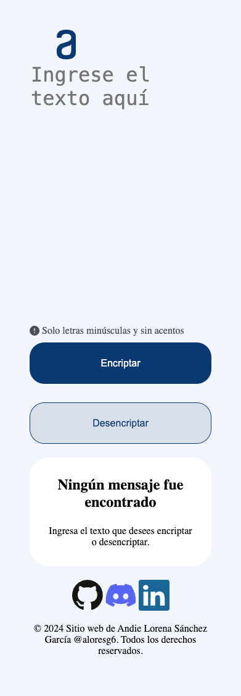

# Web Encryptor

## Descripción

**Web Encryptor** es una aplicación web que permite a los usuarios cifrar y descifrar texto utilizando un algoritmo de encriptación propio, desarrollado específicamente para este proyecto. La aplicación es fácil de usar y ofrece una interfaz amigable donde los usuarios pueden ingresar el texto a cifrar o descifrar, y obtener los resultados de inmediato.

## Características

- **Algoritmo Propio:** Utiliza un algoritmo de encriptación desarrollado específicamente para este proyecto, diseñado para ofrecer una combinación de seguridad y eficiencia.
- **Interfaz amigable:** Una interfaz de usuario intuitiva y fácil de usar.
- **100% basado en web:** No se requiere instalación, solo accede a la web y comienza a cifrar.
- **Seguridad:** Implementación de mejores prácticas de seguridad para proteger los datos.

## Capturas de pantalla






## Instalación

### Requisitos previos

- Conocimientos básicos en HTML, CSS y JS

### Instrucciones

1. Clona este repositorio:
   ```bash
   git clone https://github.com/aloresg/Encriptador.git
